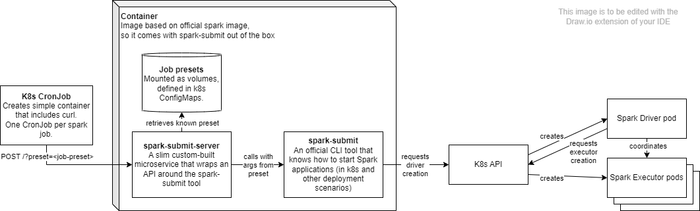

# spark-submit-server

lightweight go server that exposes [`spark-submit`](https://spark.apache.org/docs/latest/submitting-applications.html)



## Run with a kind cluster

1. create the cluster
```bash
kind create cluster
```
2. create spark namespace & serviceaccount
```bash
kubectl create -f example/spark.yaml
```
3. proxy kubernetes API to host
```bash
kubectl proxy
```
4. run the go server locally
```bash
go run . --spark-home=$SPARK_HOME_DIR --master=k8s://http://127.0.0.1:8001 --spark-conf-dir=example/sparkConf --debug
```
5. start the example
```
curl -XPOST http://localhost:7070?preset=pi
```
6. delete the kind cluster
```bash
kind cluster delete`
```
